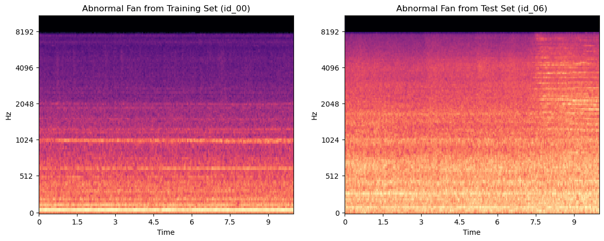
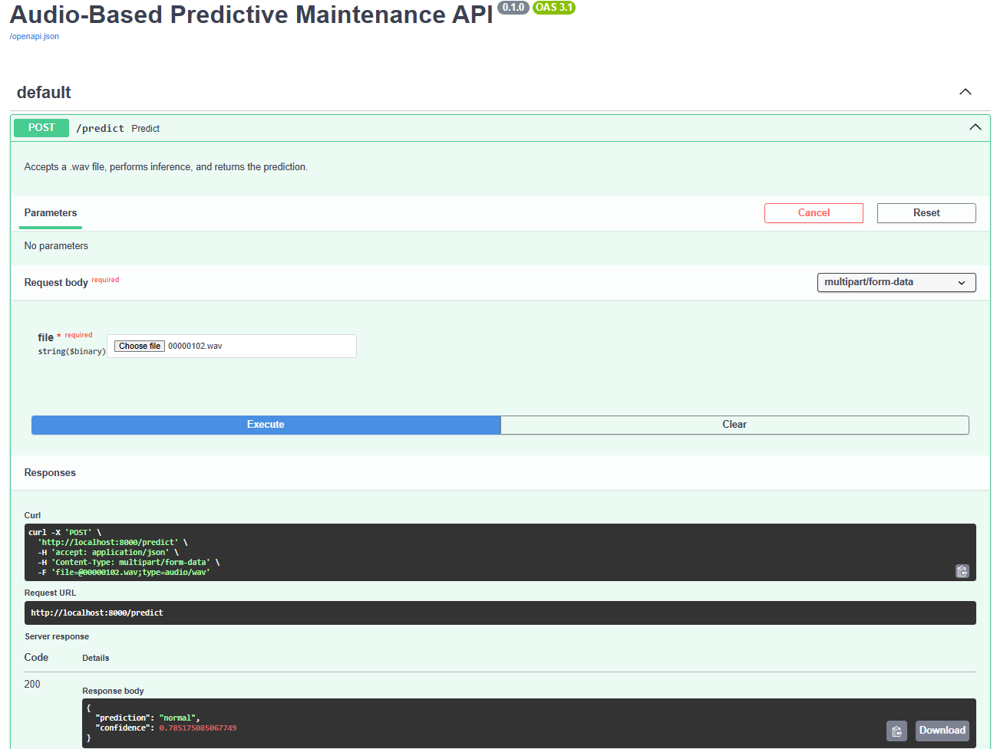

# Audio-Based Predictive Maintenance for Industrial Machinery (MLOps)

This project implements a full end-to-end MLOps pipeline for classifying the health status of industrial machinery based on audio recordings. The goal is to build a system that can listen to a short audio clip of a fan and determine if it is in a "normal" or "abnormal" condition, demonstrating a realistic workflow from data analysis to model deployment using cloud-native infrastructure.

## The Core Challenge: Generalization to Unseen Machines

A common pitfall in machine learning is creating a model that performs well in the lab but fails in the real world. This project directly confronts this challenge. The MIMII dataset contains audio from four different physical fans (`id_00`, `id_02`, `id_04`, `id_06`). An initial investigation revealed a significant **data distribution shift** between different fan units.

As shown below, the acoustic signature of an "abnormal" sound from one fan (`id_00`) is visually distinct from the signature of an "abnormal" sound from another (`id_06`). A model trained only on fans like `id_00` would fail to generalize to a new, unseen fan like `id_06`. This insight is central to the project's methodology.

<p align="center">
  
</p>

## API Service & Serverless Architecture

The trained production model is served via a **FastAPI** application wrapped in a **Mangum** adapter, allowing it to run as a serverless function on AWS Lambda. The service exposes a single `/predict` endpoint that accepts a `.wav` audio file and returns a JSON response containing the predicted label ("normal" or "abnormal") and a confidence score.

The image below shows a demo of the live application hosted on AWS, correctly classifying a test audio clip.

<p align="center">
  
</p>

## Methodology & Key Findings

To build a robust model, this project followed a multi-stage, iterative approach.

### 1. Leave-One-Group-Out (LOGO) Cross-Validation
To get an honest estimate of real-world performance, a **Leave-One-Group-Out (LOGO)** cross-validation experiment was conducted. Four separate models were trained, each holding out a different fan unit for testing. This provided a reliable performance baseline and confirmed that generalization was a significant challenge.

### 2. Data Augmentation
The key to improving generalization was identified as a lack of variety in the training data. The final production model was trained with **data augmentation** (`SpecAugment`), which randomly masks time and frequency bands in the spectrograms. This forces the model to learn more robust, generalizable features instead of overfitting to the specific acoustic properties of the training fans.

### 3. Production Model Performance
A final production model was trained on all available fan data with data augmentation enabled. This model demonstrated excellent performance on its validation set, achieving an **AUC of 0.99** and a near-perfect precision, indicating an extremely low false-alarm rate. This is the model that was used for deployment.

## Project Status: Completed

This project has employed the complete MLOps lifecycle, from initial data exploration to a fully deployed cloud-native application.

**Key Achievements:**
*   **Serverless Migration:** Implemented a scale to zero cost-optimized AWS Serverless architecture using Lambda and API Gateway.
*   **Infrastructure as Code:** Fully defined all AWS resources (ECR, Lambda, API Gateway, IAM Roles) using Terraform. Configured an **S3 Remote Backend with Native State Locking** to ensure secure and collaborative state management.
*   **CI/CD Automation:** Implemented a full CI/CD pipeline using **GitHub Actions**. The workflow automatically builds the Docker image, pushes it to ECR with version tags, and applies Terraform infrastructure updates on every push to the main branch.
*   **Optimization:** Configured AWS Lambda with 3GB memory to handle the cold-start of a large PyTorch container using "Lazy Loading" techniques.
*   **Containerization:** Built a multi-stage Docker image optimized for Lambda, using `awslambdaric` and `mangum` to bridge the gap between FastAPI and the serverless runtime.
*   **Robust ML Pipeline:** Solved a real-world data shift problem using LOGO cross-validation and data augmentation.

**Note on Cloud Deployment:**
While the Terraform code for the AWS infrastructure is complete and fully functional, the live AWS resources have been destroyed to avoid incurring unnecessary cloud costs. The project is designed to be spun up and down on demand via the CI/CD pipeline. You can run the application locally using the instructions below.

## Tech Stack

-   **Data Analysis & Modeling:** PyTorch, Librosa, Scikit-learn, Pandas
-   **API Development:** FastAPI, Uvicorn, Mangum (AWS Adapter)
-   **Containerization:** Docker
-   **Infrastructure as Code:** Terraform (S3 Backend)
-   **Cloud Provider:** AWS (Lambda, ECR, API Gateway)
-   **CI/CD & Automation:** GitHub Actions, Git LFS

## Getting Started

Follow these instructions to set up and run the project locally.

### Prerequisites

-   Git
-   Git LFS ([Install from here](https://git-lfs.github.com/))
-   Conda for environment management
-   Docker Desktop ([Install from here](https://www.docker.com/products/docker-desktop/))
-   AWS CLI (Optional, for cloud deployment)
-   Terraform (Optional, for cloud deployment)

### 1. Clone the Repository
```bash
git clone https://github.com/ayushpradhan-dev/audio-predictive-maintenance-mlops.git
cd audio-predictive-maintenance-mlops

### 2. Set Up Git LFS
Initialize Git LFS to download the model files.
```bash
git lfs install
git lfs pull
```

### 3. Create the Conda Environment
This step is required for local development and to run the data processing/training notebooks. The project uses `conda-lock` for reproducibility.
```bash
# Install the tool if you don't have it
pip install conda-lock

# Create the environmnet "audio-mlops"
conda-lock install -n audio-mlops conda-lock.yml

# Activate the environment
conda activate audio-mlops
```

### 4. Data Setup
This project uses the **MIMII Dataset (6dB Fan subset)**, which is not tracked by Git.

1.  **Download the data:** Download the `6_dB_fan.zip` file from the official dataset repository: [https://zenodo.org/records/3384388](https://zenodo.org/records/3384388).
2.  **Place and extract the data:** Create a `data/` directory in the project root and place the `6_dB_fan.zip` file inside. Extract the contents so your final structure is:
    ```
    audio-predictive-maintenance-mlops/
    └── data/
        └── fan/
            ├── id_00/, id_02/, etc.
    ```

## Usage

There are two ways to run this application: using the pre-built Docker image (recommended) or running the source code locally for development.

### 1. Run with Docker (Recommended)
This is the fastest and easiest way to get the application running. It downloads the pre-built, ready-to-run container image from Docker Hub.

**A) Pull the Image from Docker Hub:**
```bash
docker pull ayushpradhan24/audio-predictive-maintenance:latest
```

**B) Run the Docker Container:**
This command starts the container and maps your local port 8000 to the container's port 8000.
```bash
docker run -p 8000:8000 ayushpradhan24/audio-predictive-maintenance:latest
```
Once running, you can access the interactive API documentation at `http://127.0.0.1:8000/docs`.

---

### 2. Local Development & Experiments
This workflow is for users who want to modify the source code, run the data processing, or retrain the models.

**A) Process Raw Audio Data:**
This script converts all raw `.wav` files into spectrogram images. Run this once after setting up the data.
```bash
python src/audio_processor.py
```

**B) Run Experiments:**
The project contains notebooks to reproduce the experiments in the `notebooks/` directory. You will need to create the Conda environment first (see Getting Started).

**C) Run the API Server Locally:**
This command starts the FastAPI server directly on your local machine.
```bash
python src/main.py
```

## License
This project is licensed under the MIT License.

## Acknowledgements
This project uses the MIMII Dataset. Please cite the original authors if you use this data:

Harsh Purohit, Ryo Tanabe, Kenji Ichige, Takashi Endo, Yuki Nikaido, Kaori Suefusa, and Yohei Kawaguchi, "MIMII Dataset: Sound Dataset for Malfunctioning Industrial Machine Investigation and Inspection," in Proceedings of the 4th Workshop on Detection and Classification of Acoustic Scenes and Events (DCASE), 2019.

